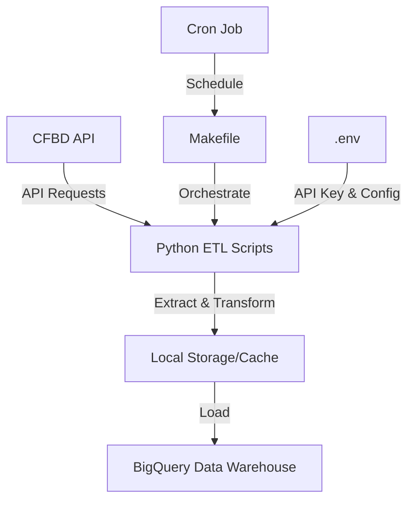

# College Football Data ETL Pipeline

A data pipeline for loading college football data from the [College Football Data API](https://api.collegefootballdata.com/api/docs/?url=/api-docs.json) into a BigQuery data warehouse.

## Project Overview

This project provides a comprehensive ETL (Extract, Transform, Load) pipeline for college football data. It extracts data from the College Football Data API, transforms it into a suitable format, and loads it into a BigQuery data warehouse for analysis.

### Architecture



### Features

- **Rate-Limited API Client**: Ensures we stay within the 5000 monthly API call limit
- **Caching**: Stores API responses locally to avoid duplicate requests
- **Configurable ETL**: Generic ETL framework that can be easily extended for new data sources
- **BigQuery Integration**: Loads data into a BigQuery data warehouse for analysis
- **Makefile Orchestration**: Simple commands to run the ETL pipeline
- **Incremental Updates**: Support for updating only the current season's data

## Getting Started

### Prerequisites

- Python 3.8+
- Google Cloud Platform account with BigQuery enabled
- College Football Data API key (get one at [collegefootballdata.com](https://collegefootballdata.com/))

### Installation

1. Clone the repository:
   ```bash
   git clone https://github.com/yourusername/cfb-data.git
   cd cfb-data
   ```

2. Create a virtual environment:
   ```bash
   conda create --name cfb-data python=3.13.1 -y
   conda activate cfb-data
   ```

3. Install dependencies:
   ```bash
   pip install -r requirements.txt
   ```

4. Set up environment variables:
   ```bash
   cp .env.example .env
   # Edit .env with your API key and GCP project ID
   ```

### Configuration

Edit the `.env` file with your credentials:

```
# API Configuration
CFBD_API_KEY=your_api_key_here

# BigQuery Configuration
GCP_PROJECT_ID=your_gcp_project_id
BQ_DATASET_ID=cfb_data
BQ_LOCATION=US
```

You can also adjust the configuration in `cfb_data/config.py` to change:
- Season range for historical data
- API rate limiting parameters
- Table names and schemas

## Usage

### Setting Up BigQuery Resources

```bash
make setup_bigquery
```

### Loading Data for a Specific Table

```bash
make load_table TABLE=games
```

With additional arguments:

```bash
make load_table TABLE=games ARGS="--year 2023 --write-disposition WRITE_TRUNCATE"
```

### Loading Historical Data

```bash
make load_historical TABLE=games
```

With custom season range:

```bash
make load_historical TABLE=games ARGS="--start-season 2018 --end-season 2023"
```

### Loading All Tables

```bash
make load_all
```

### Loading All Historical Data

```bash
make load_all_historical
```

### Updating Current Season Data

```bash
make update_current
```

### Running the Full Pipeline

```bash
make full_pipeline
```

## Data Tables

The following tables are loaded from the CFBD API:

- **games**: Game results and metadata
- **drives**: Drive-by-drive data for games
- **plays**: Play-by-play data for games
- **play_types**: Types of plays
- **teams**: Team information
- **teams_fbs**: FBS team information by season
- **talent**: Team talent composite rankings
- **conferences**: Conference information
- **venues**: Venue information
- **coaches**: Coach information

## Project Structure

```
├── LICENSE            <- Open-source license if one is chosen
├── Makefile           <- Makefile with convenience commands
├── README.md          <- The top-level README for developers using this project
├── data
│   ├── api_cache      <- Cached API responses
│   ├── external       <- Data from third party sources
│   ├── interim        <- Intermediate data that has been transformed
│   ├── processed      <- The final, canonical data sets for modeling
│   └── raw            <- The original, immutable data dump
│
├── docs               <- Documentation
│
├── pyproject.toml     <- Project configuration file
│
├── requirements.txt   <- The requirements file for reproducing the environment
│
└── cfb_data           <- Source code for use in this project
    ├── __init__.py    <- Makes cfb_data a Python module
    ├── config.py      <- Configuration variables
    ├── dataset.py     <- CLI for running ETL processes
    ├── api_client.py  <- Client for the CFBD API
    ├── bigquery_client.py <- Client for BigQuery
    └── etl/           <- ETL modules
        ├── __init__.py    <- ETL utility functions
        └── generic.py     <- Generic ETL framework
```

## Contributing

Contributions are welcome! Please feel free to submit a Pull Request.

## License

This project is licensed under the MIT License - see the LICENSE file for details.

## Acknowledgments

- [College Football Data API](https://collegefootballdata.com/) for providing the data
- [Google BigQuery](https://cloud.google.com/bigquery) for the data warehouse
